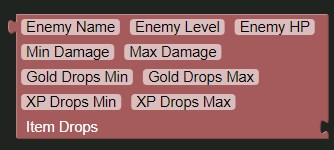

# New Enemy Block

Returns a new enemy for use with the `Set Adventure` block

| Name           | Usage                                    | Type          | Extra                                                                                                |
|----------------|------------------------------------------|---------------|------------------------------------------------------------------------------------------------------|
| Enemy Name     | The name of the mob                      | Text          |                                                                                                      |
| Enemy Level    | The level of the mob                     | Number        |                                                                                                      |
| Enemy HP       | The HP of the enemy                      | Number        |                                                                                                      |
| Min Damage     | The minmum damage the mob does           | Number        |                                                                                                      |
| Max Damage     | The maximum damage the mob does          | Number        |                                                                                                      |
| Gold Drops Min | The minimum amount of gold the mob drops | Number        | Leave as is or blank for no gold drops, requires the `Gold Drops Max` field to be filled in to work. |
| Gold Drops Max | The maximum amount of gold the mob drops | Number        | Leave as is or blank for no gold drops, requires the `Gold Drops Min` field to be filled in to work. |
| XP Drops Min   | The minimum amount of xp the mob drops   | Number        | Leave as is or blank for no xp drops, requires the `XP Drops Max` field to be filled in to work.     |
| XP Drops Max   | The maximum amount of xp the mob drops   | Number        | Leave as is or blank for no xp drops, requires the `XP Drops Min` field to be filled in to work.     |
| Item Drops     | The items the enemy drops                | List of Texts |                                                                                                      |