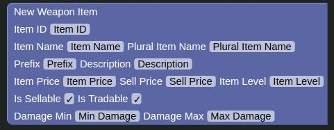

# Weapon Item Block

The weapon item block adds a new weapon item.

| Name             | Usage                                       | Type    | Other                                                                                                |
|------------------|---------------------------------------------|---------|------------------------------------------------------------------------------------------------------|
| Item ID          | The ID of the item                          | Number  |                                                                                                      |
| Item Name        | The name of the item                        | Text    |                                                                                                      |
| Plural Item Name | The plural name of the item                 | Text    | Used when there is more than one of the item.                                                        |
| Prefix           | The prefix of the item                      | Text    | Like `an` in `an apple`                                                                              |
| Description      | The items description                       | Text    |                                                                                                      |
| Item Price       | The amount of gold the item costs to buy    | Number  | Leave as-is or blank for an unbuyable item                                                           |
| Sell Price       | The amount of gold the item can be sold for | Number  | Leave as-is or blank for an unsellable item, also needs the `sellable` checkbox to be ticked to work |
| Item Level       | The level the item can be used at           | Number  |                                                                                                      |
| Is Sellable      | If the item is sellable                     | Boolean |                                                                                                      |
| Is Tradable      | If the item is tradable                     | Boolean |                                                                                                      |
| Damage Min       | The minimum damage the weapon can do        | Number  |                                                                                                      |
| Damage Max       | The maximum damage the weapon can do        | Number  |                                                                                                      |