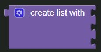

# Create List Block



Creates a list from the given blocks. If you don't supply any arguments, this creates an empty list, which you can add elements to later.
This block is a mutator. Clicking the blue cogwheel icon will allow you to add additional items to your list

### Generated Code

```js
[element1, element2, element3];
```