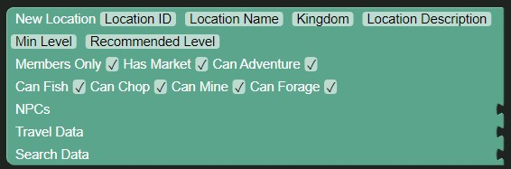

# New Location Block

The new location block creates a new location.

| Name                 | Usage                                                          | Type                                         | Extra                                                       |
|----------------------|----------------------------------------------------------------|----------------------------------------------|-------------------------------------------------------------|
| Location ID          | The ID of the location                                         | Number                                       |                                                             |
| Location Name        | The name of the location                                       | Text                                         |                                                             |
| Kingdom              | The kingdom the location is in                                 | Text                                         |                                                             |
| Location Description | The description of the location                                | Text                                         |                                                             |
| Min Level            | The minimum level the user has to be to travel to the location | Number                                       |                                                             |
| Recommended Level    | The recommended level of the location                          | Number                                       | Not used, set it to the same as the `Min Level` for now.    |
| Members Only         | If the location is only for members                            | Boolean                                      |                                                             |
| Has Market           | If the location has market access                              | Boolean                                      |                                                             |
| Can Adventure        | If users can adventure at the location                         | Boolean                                      |                                                             |
| Can Fish             | If the user can fish at the location                           | Boolean                                      |                                                             |
| Can Chop             | If the user can chop at the location                           | Boolean                                      |                                                             |
| Can Mine             | If the user can mine at the location                           | Boolean                                      |                                                             |
| Can Forage           | If the user can forage at the location                         | Boolean                                      |                                                             |
| NPCs                 | The NPCs that are at the location                              | List of Numbers                              | Numbers in the list are the IDs of the NPCs at the location |
| Travel Data          | The travel data of the location                                | List of [TravelData](./traveldata.md) blocks |                                                             |
| Search Data          | The search data of the location                                | List of [SearchData](./searchdata.md) blocks |                                                             |