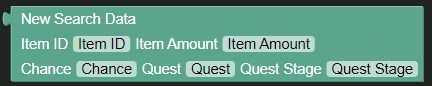

# Search Data Block

The search data block returns a new search data object.

| Name        | Usage                                                                                  | Type   | Extra                                                                                                                               |
|-------------|----------------------------------------------------------------------------------------|--------|-------------------------------------------------------------------------------------------------------------------------------------|
| Item ID     | The ID of the item that is searched for                                                | Text   |                                                                                                                                     |
| Item Amount | The amount of items the user gets on a successful search                               | Number |                                                                                                                                     |
| Chance      | The chance of search success for the item                                              | Number | Goes from `0%` to `100%`                                                                                                            |
| Quest       | The internal name of the quest the user has to be in to be able to search for the item | Text   | Leave blank or as is for the item to be searchable all the time.                                                                    |
| Quest Stage | The stage of the quest the user needs to be at to be able to search for the item       | Number | Leave blank or as is for the user to be able to search for the item in the quest at all times. Requires a value in `Quest` to work. |