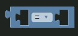
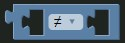
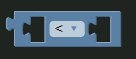
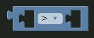
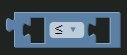
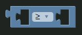

# Equals Block



The equals block returns true if both inputs are equal.

To specify the blocks comparison type, use the dropdown in the center of the block.

### Generated Code

**=**

```js
input1 == input2;
```

# Not Equals Block



The not equals block returns true if both inputs aren't equal.

### Generated Code

**≠**

```js
input1 != input2;
```

# Less Than Block



The less than block returns true if the first input is less than the second input.

### Generated Code

**<**

```js
input1 < input2;
```

# More Than Block



The more than block returns true if the first input is more than the second input.

### Generated Code

**>**

```js
input1 > input2;
```

# Less Than or Equal Block



The less than or equal block returns true if the first input is less than or equal to the second input.

### Generated Code

**≤**

```js
input1 <= input2;
```


# More Than or Equal Block



The less than or equal block returns true if the first input is more than or equal to the second input.

### Generated Code

**≥**

```js
input1 >= input2;
```
