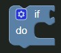

# If Block



The if block executes a block of code if a specified condition is true.

To specify a condition, add a block to the `if` input.

To specify what should be executed if the condition is true, add blocks to the `do` input.

### Generated Code

```js
if (condition) {
	// Do
}
```