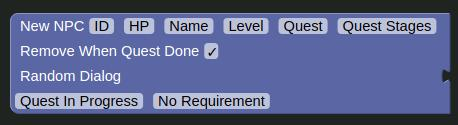

# NPC Block

The NPC block creates a new NPC.

### Parameters

| Name                   | Usage                                                                          | Type          | Other                                                    |
|------------------------|--------------------------------------------------------------------------------|---------------|----------------------------------------------------------|
| ID                     | The NPCs ID                                                                    | Number        |                                                          |
| HP                     | The NPCs HP                                                                    | Number        | Isn't actually used, but needs to be set.                |
| Name                   | The NPCs Name                                                                  | Text          |                                                          |
| Level                  | The NPCs Level                                                                 | Number        | Isn't actually used, but needs to be set.                |
| Quest                  | The quest the NPC is a part of.                                                | Text          |                                                          |
| Quest Stages           | The stages of the quest the NPC is a part of.                                  | Text          | )Each stage is a number and is seperated with a comma (, |
| Remove When Quest Done | If the NPC should be removed when the NPCs quest is completed by the user.     | Boolean       |                                                          |
| Random Dialog          | The dialog the NPC has                                                         | List of Texts |                                                          |
| Quest In Progress      | The dialog the NPC has when another quest is in progress                       | Text          |                                                          |
| No Requirement         | The dialog the NPC has when the user doesn't meet the requirements for a quest | Text          |                                                          |