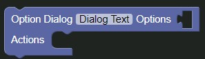

# Option Dialog Block

The option dialog block will generate a dialog box with the items in a specified list, up to nine options.

The block returns a promise with the zero-indexed item number in the list the user clicked. 

### Parameters

| Name        | Usage                                | Type  | Other |
|-------------|--------------------------------------|-------|-------|
| Dialog Text | The Text the NPC should be saying    | Text  |       |
| Options     | The options the user can choose from | List  |       |

This block is compatible with the [Promise Block](./promise.md)