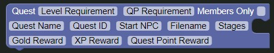

# Quest Block

The quest block creates a new quest wrapper and is needed to create a quest.

### Parameters

| Name               | Usage                                                     | Type    | Other |
|--------------------|-----------------------------------------------------------|---------|-------|
| Level Requirement  | The level that is needed to start the quest               | Number  |       |
| QP Requirement     | The amount of quest points needed to start the quest.     | Number  |       |
| Members Only       | If the quest is members only.                             | Boolean |       |
| Quest Name         | The name of the quest                                     | Text    |       |
| Quest ID           | The ID of the quest                                       | Number  |       |
| Start NPC          | The ID of the NPC that starts the quest                   | Number  |       |
| Filename           | The internal name of the quest                            | Text    |       |
| Stages             | The amount of stages the quest has                        | Number  |       |
| Gold Reward        | The amount of gold the user will be rewarded with         | Number  |       |
| XP Reward          | The amount of XP the user will be rewarded with           | Number  |       |
| Quest Point Reward | The amount of quest points the user will be rewarded with | Number  |       |