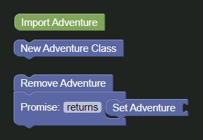

So, you want to create an enemy, eh?
Oh boy, do I have some good news for you, because in this guide, that's exactly what we're going to do, let's go!

Please note that this guide will only go over how to create the enemy and properly setting it for the user, and as such will not have the context of stages.

# Starting out

So, to start out, we need to drag out the [`Import Adventure Block`](../../blocks/imports/import_adventure.md) from the `Imports` category in the toolbox in order to be able to set the users adventure later, and we need to place it above our `Quest` wrapper block.

Once that's done, drag a [`New Adventure Class Block`](../../blocks/quest/new_adventure.md) to the workspace from the `Quest` category and leave it there for now.

After this, drag a [`Remove Adventure Block`](../../blocks/quest/remove_adventure.md) to the workspace.

Next up, drag a [`Promise Block`](../../blocks/quest/promise.md) to the workspace and attach it to the `Remove Adventure` block we just added.

Then, drag a [`Set Adventure Block`](../../blocks/quest/set_adventure.md) to the workspace and attach to the inside of the Promise block we just added.

Once done, it should something like this:

# Adding the enemy

We're done with the groundwork, great!

Let's add the enemy itself.

To do this, drag a [`New Enemy Block`](../../blocks/enemies/new_enemy.md) and attach it to the `Set adventure` block.

Refering to the documentation of the enemy block, we can see that we need to fill in all the values, so for this guide, let's say our enemy is level 10, has 1000 HP, does 5 to 10 damage and is named `Scary Monster`.

Along with this, let's say it drops 100 to 150 gold, and the same amount of XP, and that it drops one rock which has the ID `42` that we can use later to check if the enemy has been killed.

## Adding Item Drops

To add our rock, we need to drag a [`Create List With`](../../blocks/list/create_list.md) block and set it to only have one item by clicking the cogwheel icon and then dragging two of the three `item` blocks to the grey area, then close it by clicking the cogwheel again.

Lastly, add a [`Text Block`](../../blocks/text/text.md) and add it to the `List` block we added, and add the ID of the rock in.

