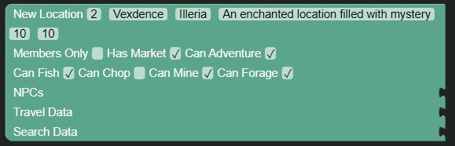
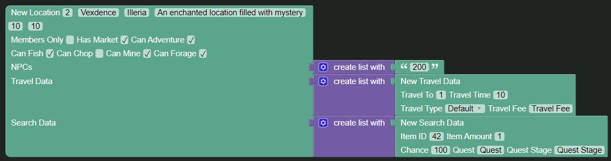

# Creating the location

In order to create the location, we need to have some basic data for the location to make the creation as simple as possible.

If we refer to the [Location Block Documentation](../../blocks/locations/new_location.md) we see what data we need.

In order to efficiently keep track of the data, I like to write a small note with the data, keeping the different types of data on their own line, and using `==` to seperate different sections of the data.

To specify a location in the travelling data we'll use square brackets with the location name in them (`[Location Name]`)

For now, let's go with the following:

```
Name: Vexdence
Kingdom: Illeria
Description: An enchanted location filled with mystery
Minimum Level: 10
Members Only: No
Has Market: Yes
Can Adventure: Yes

== Sides ==

Can Fish: Yes
Can Chop: No
Can Mine: Yes
Can Forage: Yes

== NPCs ==

Josh <ID: 200>

== Travel Data ==

[Silverkeep]
	ID: 1
	Travel Time: 10 seconds
	Travel Type: Default

== Search Data ==

[Rock]
	ID: 42
	Amount: 1
	Chance: 100

```

# Adding the Location

Great! Now we have our location data written down, and we can start actually creating it.

To do this, drag a [`New Location Block`](../../blocks/locations/new_location.md) into the workspace from the `Locations` category of the toolbox and fill it in with the values we specified in our data file, giving the `Location ID` the value of `2` for now and giving the `Recommended Level` field the same value as our `Min Level` field as specified in the blocks documentation.



## Adding NPCs

Now that we've got our fields in, let's add our NPC.

To do this, drag a [`Create List With`](../../blocks/lists/create_list.md) block to the workspace and attach it to the `NPCs` field of the location block, then remove two items from the list by clicking the cogwheel, dragging the `item` blocks to the grey area and clicking the cogwheel again to close it.

Next, add a [`Text`](../../blocks/text/text.md) block to the list and set it to the ID of our NPC, `200`.


## Adding Travel Data

Alright! Now we have to add our travel data!

To do this, drag a [`Create List With`](../../blocks/lists/create_list.md) block to the workspace and attach it to the `Travel Data` field of the location block, then remove two items from the list by clicking the cogwheel, dragging the `item` blocks to the grey area and clicking the cogwheel again to close it.

When there is one item left in the list, drag a [`New Travel Data`](../../blocks/locations/traveldata.md) block to the spot in the list and fill it with our Travel Data from the Location Data we wrote earlier.


## Adding Search Data

We're almost done, we just have to add our search data now.

To add the search data, drag a [`Create List With`](../../blocks/lists/create_list.md) block to the workspace and attach it to the `Search Data` field of the location block, then remove two items from the list by clicking the cogwheel, dragging the `item` blocks to the grey area and clicking the cogwheel again to close it.

After this, drag a [`New Search Data`]() block to the spot in the list we just added and fill it with the values we have in our location data.


## Done!

And we're done!

If everything was done right, you should end up with something such as this:

