# Creating Stage 1

Alright, let's focus on the first stage.

Recalling the story we wrote at the start of this guide, we can see that the first stage is
```
== Stage 1 ==

Julian - Hi there, I have an issue and I need some logs, would you mind getting them for me?
* Option 1: Sorry, I'm kind of busy right now.
* Option 2: Sure, I'd love to!

[Option 1]
	Julian - I see, maybe I can find someone else to help me.
[Option 2]
	Julian - Great! I need 5 Oak Logs!
	{Continue Check}
    	{Start Quest}
        {Send Message "Quest Started: ${this.name}.\n[Written by Username]"}
```

### Building the stage

In the quest block, let's focus on the `New Stage: 1` block as this is our first stage.

To build the first dialog with options, drag a [`Option Dialog`](../../blocks/quest/optiondialog.md) block from the `Quest` tab of the toolbox and attach it to the stage block.

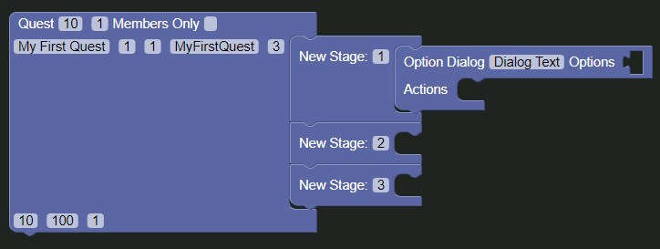

#### Setting the NPC Dialog
To set the NPCs dialog, edit the `Dialog Text` variable with our dialog which in this case is `Hi there, I have an issue and I need some logs, would you mind getting them for me?`

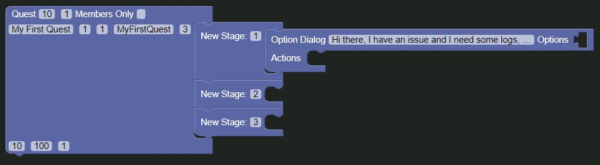

#### Setting the Options
To set the options, drag a [`Create List Block`](../../blocks/list/create_list.md) from the `Lists` tab of the toolbox.

Since we have two options, we only need two items in our list, to do this, click the cogwheel icon of the list block, and drag one of the `item` blocks into the gray area to delete it. When  this has been done, click the cogwheel icon again to close it.

Then, drag two [`Text`](../../blocks/text/text.md) blocks from the `Text` tab of the toolbox and attach them to the list block.

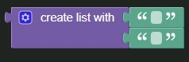

After this, we need to fill in our options, `Sorry, I'm kind of busy right now.` and `Sure, I'd love to!`.

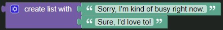

When we've done this, we need to drag the list block with the options filled in into the `Options` input of the `Option Dialog` block.

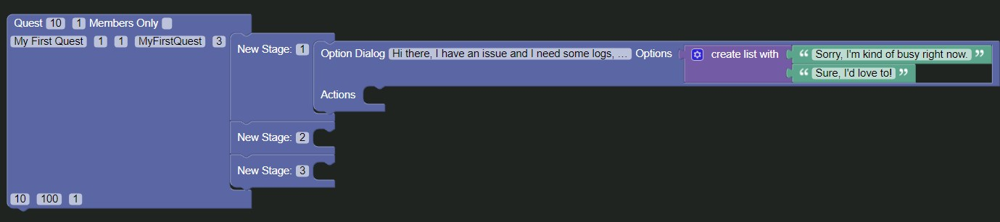


#### Continuing the options

Next, drag a [`Promise Block`](../../blocks/quest/promise.md) from the `Quest` tab into the workspace and attach it to the `Option Dialog` block.

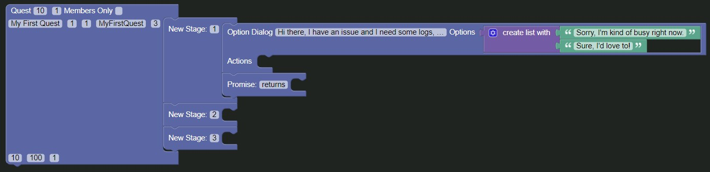

Then, change the `returns` to `option`


Next up, drag an [`if block`](../../blocks/logic/if.md) from the `Logic` tab and an [`Option Block`](../../blocks/quest/option.md) from the `Quest` tab into the workspace.

Set the `option` variable of the `Option` block to `0`.

Attach the `Option` block to the `if` statement of the `if` block and attach the `if` block to the inside of the `Promise` block we created earlier.

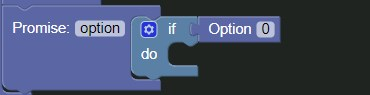

When this is done, drag a [`Dialog Block`](../../blocks/quest/dialog.md) from the `Quest` tab and attach it to the `do` variable of the `if` block and then set the `Dialog Text` to `I see, maybe I can find someone else to help me.`

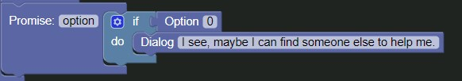

#### Second option

Alright, now that we have the first option done, the second one should be pretty straight-forward.

Click the cogwheel of the `if` block and drag an `else if` block from the gray area and attach it to the `if` block and then close it by clicking the cogwheel again.

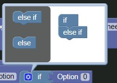

Then, attach another `Option` block to the `else if` variable, setting the `option` to `1`.

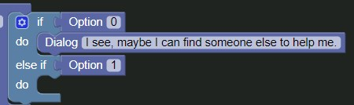

Now drag a dialog block from the `Quest` tab and attach it to the `do` of the `else if` section of the `if` block, setting the `Dialog Text` to `Great! I need 5 Oak Logs!`.

After this, attach a `Promise` block to the `Dialog` block and set the `returns` variable to `msg`.

Then, drag a [`Continue Check Block`](../../blocks/quest/continuecheck.md) from the `Quest` tab and attach it to the inside of the `Promise` block.

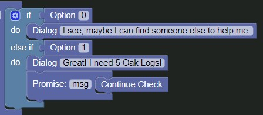

#### Almost done

Drag two `Promise` blocks to the workspace and attach them to the bottom of the one we just created with a `Continue Check` block.

In the first one, add a [`Start Quest Block`](../../blocks/quest/start_quest.md) from the `Quest` tab.

In the second one, add a [`Send Message Block`](../../blocks/quest/send_message.md) from the `Quest` tab and set the `Message` variable to `` `Quest Started: ${this.name}.\n[Written by Username]` ``, replacing `Username` with your Discord Username and Discriminator (The Four numbers at the end of your name), which in my case is `Mackan#7196`

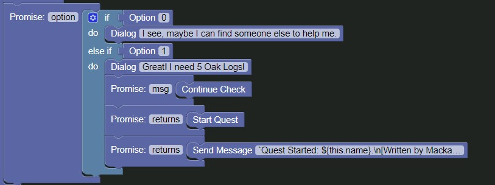

#### Completed

Alright! We've completed the first stage, let's continue to stage 2!