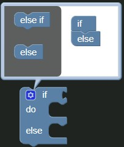
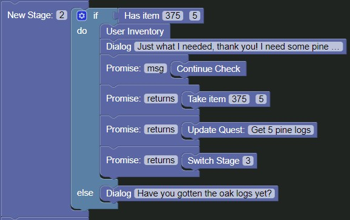

# Creating Stage 2

Alright, let's focus on the second stage.

Recalling the story we wrote at the start of this guide, we can see that the second stage is
```
== Stage 2 ==

{If User Has 5 Oak Logs}
	Julian - Just what I needed, thank you! I need some pine logs too, do you mind getting those for me too?
    {Continue Check}
    	{Take 5 Oak Logs from User Inventory}
    	{Update Quest with Text "Get 5 pine logs"}
        {Switch to Stage 3}
{Else}
	Julian - Have you gotten the oak logs yet?
```

### Building the stage

In the quest block, let's focus on the `New Stage: 2` block as this is our second stage.

Starting out, drag an [`if block`]() from the `Logic` tab to the workspace and edit it to have an `else` block by clicking the cogwheel icon and dragging an `else` block from the gray area to the `if` block, then clicking the cogwheel to close it again.



After this, attach a [`Has Item`](../../blocks/quest/has_item.md) block from the `Quest` to the `if` condition, set the `Item ID` to the ID of the Oak Logs which was `375` as we recall from our storywriting, and the `Item Amount` to 5, then attach it to the `New Stage: 2` block.


Drag a `Dialog` block into the `else` argument of the `if` block and set the `Dialog Text` to `Have you gotten the oak logs yet?`


Drag another `Dialog` block into the `do` argument of the `if` block and set the `Dialog Text` to `Just what I needed, thank you! I need some pine logs too, do you mind getting those for me too?`

Drag a [`Promise Block`](../../blocks/quest/promise.md) from the `Quest` tab and attach it to the bottom of the `Dialog` block we just added and change the `returns` variable to `msg`, then add a [`Continue Check Block`](../../blocks/quest/continuecheck.md) to the promise block.


___

Drag three more `Promise` blocks and attach them to the bottom of the first one in our current stage.

In the first one, add a [`Take Item Block`](../../blocks/quest/take_item.md), set the `Item ID` to the ID of the Oak Logs and the amount to `5`.

In the second one, add a [`Update Quest Block`](../../blocks/quest/update_quest.md) and set the `Quest Updated` variable to `Get 5 pine logs`

In the last one, add a [`Switch Stage Block`](../../blocks/quest/switch_stage.md) and set the `Next Stage` variable to our next stage, `3`.

After this is done, drag a [`User Inventory Block`](../../blocks/quest/user_inventory.md) and attach it right under the `Has Item` block.



#### Completed

Alright! We've completed the second stage too! Let's continue to the last stage!