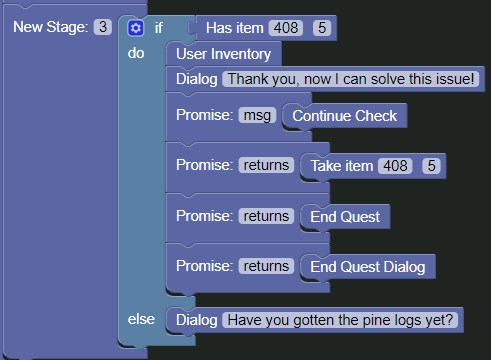

# Creating Stage 3

Alright, let's focus on the last stage of our quest.

Recalling the story we wrote at the start of this guide, we can see that the third and last stage is
```
== Stage 3 ==

{If User Has 5 Pine Logs}
	Julian - Thank you, now I can solve this issue!
    {Continue Check}
    	{Take 5 Pine Logs from User Inventory}
    	{End Quest}
        {Send End Quest Dialog}
{Else}
	Julian - Have you gotten the pine logs yet?
```

### Building the stage

In the quest block, let's focus on the `New Stage: 3` block.

Starting out, drag an [`if block`]() from the `Logic` tab to the workspace and edit it to have an `else` block by clicking the cogwheel icon and dragging an `else` block from the gray area to the `if` block, then clicking the cogwheel to close it again.


After this, attach a [`Has Item`](../../blocks/quest/has_item.md) block from the `Quest` to the `if` condition, set the `Item ID` to the ID of the Pine Logs which was `408` as we recall from our storywriting, and the `Item Amount` to 5, then attach it to the `New Stage: 3` block.


Drag a `Dialog` block into the `else` argument of the `if` block and set the `Dialog Text` to `Have you gotten the pine logs yet?`


Drag another `Dialog` block into the `do` argument of the `if` block and set the `Dialog Text` to `Thank you, now I can solve this issue!`

Drag a [`Promise Block`](../../blocks/quest/promise.md) from the `Quest` tab and attach it to the bottom of the `Dialog` block we just added and change the `returns` variable to `msg`, then add a [`Continue Check Block`](../../blocks/quest/continuecheck.md) to the promise block.


___

Drag three more `Promise` blocks and attach them to the bottom of the first one in our current stage.

In the first one, add a [`Take Item Block`](../../blocks/quest/take_item.md), set the `Item ID` to the ID of the Pine Logs and the amount to `5`.

In the second one, add a [`End Quest Block`](../../blocks/quest/end_quest.md).

In the last one, add a [`End Quest Dialog Block`](../../blocks/quest/end_quest_dialog.md).

After this is done, drag a [`User Inventory Block`](../../blocks/quest/user_inventory.md) and attach it right under the `Has Item` block.



#### Completed

Alright! We've completed the quest!

Next up, you can write your own quest and build it yourself, then submit it to Mackan!