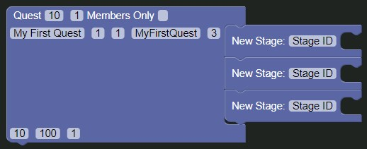
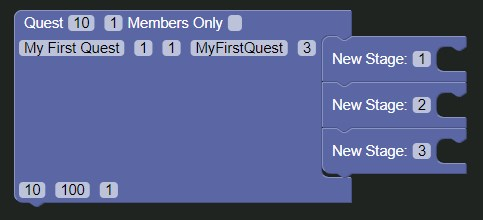

# Adding Stages

Alright, let's add three stage blocks to out quest block. To do this, click the `Quest` tab in the toolbox and drag out three [`Stage`](../../blocks/quest/stage.md) blocks and put them into the `Quest` block.

After this, set the `Stage ID` variables to `1`, `2` and `3`.

# But what is a stage?

A stage is a section of the quest and is used when you need to separate sections of the quest into stages.

### Added the stages?

Good, let's continue to the next step.