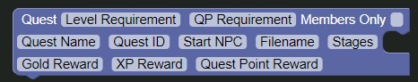
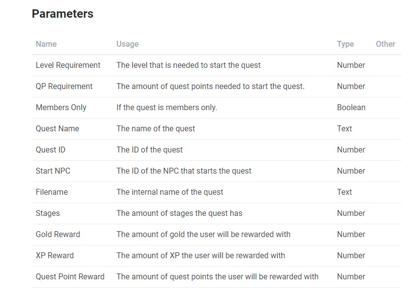
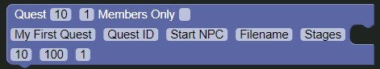
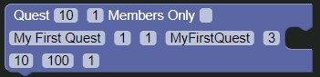

# Starting Out

So, you've got your story and you're ready to get your quest creation game on, great!

Let me show you how it's done!

To start out, drag a [`Quest`](../../blocks/quest/quest.md) block from the toolbox into the editor by clicking the `Quest` link and then dragging the `Quest` block out from it and releasing the mouse.

If you've done it right, your workspace should look like this:

### Filling it in

Now, you're probably confused about all the values of the block and how to fill it in, but fear not, because I'll tell you how to!

According to the parameters on the [Quest Block Documentation](../../blocks/quest/quest.md) page, they should be filled in as such:

So, let's say we have the following values that we want:

| Parameter          | Value          |
|--------------------|----------------|
| Level Requirement  | 10             |
| QP Requirement     | 1              |
| Members Only       | false          |
| Quest Name         | My First Quest |
| Gold Reward        | 10             |
| XP Reward          | 100            |
| Quest Point Reward | 1              |

If we were to fill them into the block, it would look something such as this:

### But what about the other fields?

I'm glad you asked, because I'm getting there now.

#### Quest ID

The Quest ID is the internal ID of the quest and is used by the bot to keep track of the users current quest, you can set this to whatever number you want.

#### Start NPC

The Start NPC is the internal ID of the NPC you want the user to talk to in order to start the quest, in order to get the ID of a NPC, please ask Mackan on the official Discord server at [https://drpg.xyz/Discord](https://drpg.xyz/Discord).

For now, let's use the ID `1`

#### Filename

The filename is used to keep track of the quest and is the internal name of the quest.

Usually, this is the quest name without spaces, so in our case it would be `MyFirstQuest`.

#### Stages

The stages variable is the amount of stages the quest has, this is determined by the amount of stage blocks you have in your quest, more info on this later, for now, set it to 3.

___

### Filled in

When all of this is filled in, it should look something along the lines of this:

Alright, let's continue to the next step.